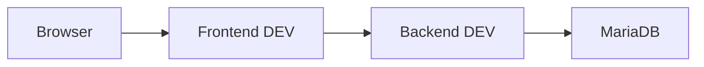
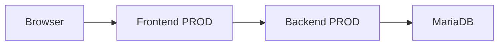

# Installations- und Betriebshandbuch

## Inhaltsverzeichnis

- [Installations- und Betriebshandbuch](#installations--und-betriebshandbuch)
  - [Inhaltsverzeichnis](#inhaltsverzeichnis)
  - [1. Zweck und Geltungsbereich](#1-zweck-und-geltungsbereich)
    - [1.1 Ziel des Dokuments](#11-ziel-des-dokuments)
    - [1.2 Zielgruppe](#12-zielgruppe)
    - [1.3 Abgrenzung zu anderen Dokumenten](#13-abgrenzung-zu-anderen-dokumenten)
  - [2. Systemübersicht](#2-systemübersicht)
    - [2.1 Zweck des Systems](#21-zweck-des-systems)
    - [2.2 Betriebsmodell](#22-betriebsmodell)
    - [2.3 Systemkomponenten](#23-systemkomponenten)
  - [3. Systemvoraussetzungen](#3-systemvoraussetzungen)
    - [3.1 Hardware](#31-hardware)
    - [3.2 Software](#32-software)
    - [3.3 Netzwerkzugang](#33-netzwerkzugang)
  - [4. Infrastrukturübersicht](#4-infrastrukturübersicht)
    - [4.1 Plattform](#41-plattform)
    - [4.2 Containerlandschaft](#42-containerlandschaft)
    - [4.3 Umgebungen](#43-umgebungen)
      - [DEV](#dev)
      - [PROD](#prod)
  - [5. Docker-Netzwerkarchitektur](#5-docker-netzwerkarchitektur)
    - [5.1 EMC Hauptnetzwerk](#51-emc-hauptnetzwerk)
    - [5.2 Teilnehmer im EMC Hauptnetzwerk](#52-teilnehmer-im-emc-hauptnetzwerk)
    - [5.3 Kommunikationsmodell](#53-kommunikationsmodell)
      - [DEV](#dev-1)
      - [PROD](#prod-1)
    - [5.4 Infrastruktur-Netzwerke](#54-infrastruktur-netzwerke)
      - [mariadb\_default](#mariadb_default)
      - [uptime-kuma\_default](#uptime-kuma_default)
    - [5.5 Netzwerkgrundsätze](#55-netzwerkgrundsätze)
  - [6. Konfigurationsmanagement](#6-konfigurationsmanagement)
    - [6.1 Frontend Konfiguration](#61-frontend-konfiguration)
    - [6.2 Backend Konfiguration](#62-backend-konfiguration)
    - [6.3 Datenbank Konfiguration](#63-datenbank-konfiguration)
    - [6.4 Backup Konfiguration](#64-backup-konfiguration)
    - [6.5 Stack-Verwaltung](#65-stack-verwaltung)
  - [7. Erstinstallation](#7-erstinstallation)
    - [7.1 Installationsprinzip](#71-installationsprinzip)
    - [7.2 Docker Host vorbereiten](#72-docker-host-vorbereiten)
    - [7.3 Portainer bereitstellen](#73-portainer-bereitstellen)
    - [7.4 Netzwerke anlegen](#74-netzwerke-anlegen)
    - [7.5 Datenbank bereitstellen](#75-datenbank-bereitstellen)
    - [7.6 Backup-Service bereitstellen](#76-backup-service-bereitstellen)
    - [7.7 Backend bereitstellen](#77-backend-bereitstellen)
    - [7.8 Frontend bereitstellen](#78-frontend-bereitstellen)
    - [7.9 Monitoring bereitstellen](#79-monitoring-bereitstellen)
    - [7.10 Erstprüfung](#710-erstprüfung)

---

## 1. Zweck und Geltungsbereich

### 1.1 Ziel des Dokuments

Dieses Dokument beschreibt die Installation, den technischen Betrieb und die administrative Betreuung der EMC Mitgliederverwaltung.

Ziel ist eine nachvollziehbare technische Betriebsdokumentation für Installation, Betrieb, Wartung und Überwachung der Anwendung.

Das Dokument beschreibt den aktuell realisierten Betriebsstand einschließlich Übergangsarchitekturen.

---

### 1.2 Zielgruppe

Dieses Dokument richtet sich an technisch verantwortliche Personen.

Insbesondere:

- Systemadministration
- technische Projektverantwortliche
- Betreiber der NAS-/Docker-Infrastruktur
- zukünftige technische Nachfolger im Vereinsbetrieb

Es handelt sich nicht um ein Endanwenderhandbuch.

---

### 1.3 Abgrenzung zu anderen Dokumenten

Dieses Dokument beschreibt den technischen Betrieb.

Nicht Bestandteil:

| Thema | Dokument |
|------|----------|
| Systemarchitektur | `04-architektur.md` |
| Release / Deployment Prozesse | `02-deployment.md` |
| Benutzerbedienung | `03-benutzerhandbuch.md` |
| Fehlerbehebung / Recovery | `05-troubleshooting.md` |

---

## 2. Systemübersicht

### 2.1 Zweck des Systems

Die EMC Mitgliederverwaltung ist eine webbasierte Anwendung zur Verwaltung von Mitgliederdaten des EMC.

Ziel ist die schrittweise Ablösung der bisherigen Microsoft-Access-basierten operativen Mitgliederpflege.

Die Anwendung unterstützt aktuell:

- Mitgliederverwaltung
- Stammdatenpflege
- Kontaktdatenpflege
- Mitgliedschaftsverwaltung
- Datenschutzdaten
- Chorkleidungsverwaltung
- Benutzerverwaltung
- Rollen- und Rechteverwaltung

---

### 2.2 Betriebsmodell

Die Anwendung wird containerisiert auf einem NAS betrieben.

Betriebsmodell:

- Docker-basierter Betrieb
- Portainer-basierte Stack-Verwaltung
- getrennte DEV- und PROD-Umgebung
- zentrale MariaDB-Datenhaltung
- Monitoring via Uptime Kuma
- automatisierte Datenbank-Backups

Die Architektur befindet sich aktuell in einem produktivnahen Pilotbetrieb.

> [!NOTE]
> Die aktuelle Betriebsarchitektur enthält bewusst Übergangsstrukturen zur Microsoft-Access-Altwelt.

---

### 2.3 Systemkomponenten

Die Betriebsumgebung umfasst folgende Hauptkomponenten:

| Komponente | Funktion |
|----------|----------|
| Frontend DEV | React Webanwendung |
| Backend DEV | Spring Boot API |
| Frontend PROD | React Webanwendung |
| Backend PROD | Spring Boot API |
| MariaDB | zentrale Datenhaltung |
| mariadb-backup | automatisierte Datenbank-Backups |
| phpMyAdmin | Datenbankadministration |
| Uptime Kuma | Monitoring |
| Portainer | Container-/Stack-Verwaltung |

---

## 3. Systemvoraussetzungen

### 3.1 Hardware

Aktuelle Betriebsplattform:

```text
UGREEN DH2300 NAS
```

Erforderlich:

- Docker-fähige Hostplattform
- ausreichender Speicherplatz für Container, Images und Backups
- persistente Datenspeicherung
- stabile Netzwerkverbindung

---

### 3.2 Software

Aktuell eingesetzte Plattformsoftware:

- Docker
- Portainer
- nginx
- MariaDB
- Uptime Kuma
- phpMyAdmin

Anwendungskomponenten:

Frontend:

- React 19
- Vite
- nginx

Backend:

- Java 21
- Spring Boot 3
- Spring Security

Datenbank:

- MariaDB

---

### 3.3 Netzwerkzugang

Aktueller Zugriff:

- lokales Netzwerk
- VPN-basierter externer Zugriff

Perspektivisch geplant:

- Domain-basierter Zugriff
- Reverse Proxy
- HTTPS/TLS

Netzwerkvoraussetzungen:

- Zugriff auf NAS
- Docker Netzwerkkommunikation
- Zugriff auf veröffentlichte Frontend-Ports

---

## 4. Infrastrukturübersicht

### 4.1 Plattform

Die Anwendung läuft vollständig auf einer zentralen NAS-Plattform.

Aktuelle Plattform:

```text
UGREEN DH2300
```

Betriebsmodell:

- zentraler Container-Host
- Docker Runtime
- Stack-Verwaltung via Portainer

Die Anwendung ist nicht auf mehrere Hosts verteilt.

---

### 4.2 Containerlandschaft

Aktuell laufende Container:

| Container | Funktion |
|----------|----------|
| emc-mitglieder-frontend-dev | DEV Frontend |
| emc-mitglieder-backend-dev | DEV Backend |
| emc-mitglieder-frontend-prod | PROD Frontend |
| emc-mitglieder-backend-prod | PROD Backend |
| mariadb | zentrale Datenbank |
| mariadb-backup | Backup-Service |
| phpmyadmin | Datenbankadministration |
| uptime-kuma | Monitoring |
| portainer | Containerverwaltung |

---

### 4.3 Umgebungen

Die Anwendung unterscheidet zwei technische Umgebungen.

#### DEV

Zweck:

- Entwicklung
- Tests
- technische Validierung
- Vorstufe für PROD

Komponenten:

- DEV Frontend
- DEV Backend
- DEV Datenbank

---

#### PROD

Zweck:

- produktivnaher Pilotbetrieb
- operative Nutzung

Komponenten:

- PROD Frontend
- PROD Backend
- PROD Datenbank

> [!NOTE]
> DEV und PROD teilen sich aktuell dieselbe MariaDB-Instanz, verwenden jedoch getrennte Datenbanken.

---

## 5. Docker-Netzwerkarchitektur

Die EMC Mitgliederverwaltung verwendet mehrere Docker-Netzwerke mit klarer funktionaler Trennung.

---

### 5.1 EMC Hauptnetzwerk

Zentrales Betriebsnetzwerk:

```text
emc_net
```

Eigenschaften:

- Docker Bridge Netzwerk
- internes Anwendungsnetz
- Kommunikation zwischen EMC-Anwendungskomponenten

Technische Eigenschaften:

```text
Subnetz: 172.18.0.0/16
Typ: bridge
```

---

### 5.2 Teilnehmer im EMC Hauptnetzwerk

Aktuell angeschlossene Container:

- emc-mitglieder-frontend-dev
- emc-mitglieder-backend-dev
- emc-mitglieder-frontend-prod
- emc-mitglieder-backend-prod
- mariadb
- uptime-kuma

Dieses Netzwerk bildet das zentrale Kommunikationsnetz der EMC Anwendung.

---

### 5.3 Kommunikationsmodell

#### DEV

Kommunikationsfluss:



---

#### PROD

Kommunikationsfluss:



---

### 5.4 Infrastruktur-Netzwerke

Zusätzlich existieren weitere Docker-Netzwerke.

#### mariadb_default

Zweck:

Datenbanknahe Infrastruktur

Teilnehmer:

- mariadb
- phpmyadmin
- mariadb-backup

Dieses Netzwerk dient Datenbankadministration und Backup.

---

#### uptime-kuma_default

Zweck:

Monitoring-Infrastruktur

Teilnehmer:

- uptime-kuma

---

### 5.5 Netzwerkgrundsätze

Architekturprinzipien:

- Backend nicht direkt extern exponieren
- interne Containerkommunikation über Docker-Netzwerke
- funktionale Netztrennung
- Monitoring separat
- Datenbankinfrastruktur separat

---

## 6. Konfigurationsmanagement

Die Anwendung nutzt komponentenspezifische Konfiguration.

Die Konfiguration ist abhängig von Umgebung und Komponente.

---

### 6.1 Frontend Konfiguration

Das Frontend wird als statischer React Build über nginx ausgeliefert.

Konfigurationsbestandteile:

- nginx Konfiguration
- API Reverse Proxy Routing
- React Build Artefakte

Aktuelle Proxy-Konfiguration:

```text
location /api/
proxy_pass -> Backend
```

DEV:

```text
emc-mitglieder-backend-dev:8080
```

PROD:

```text
emc-mitglieder-backend-prod:8080
```

Zweck:

- gleiche Browser-Origin
- Backend nicht direkt veröffentlichen
- vereinfachte Sessionkommunikation

---

### 6.2 Backend Konfiguration

Das Backend wird containerisiert betrieben.

Typische Konfigurationsbereiche:

- Datenbankverbindung
- Spring Profile
- Sicherheitskonfiguration
- Session-Verhalten
- Logging

Umgebungsspezifisch:

- DEV
- PROD

---

### 6.3 Datenbank Konfiguration

MariaDB dient als zentrale Datenhaltung.

Aktuelle Datenbanken:

| Umgebung | Datenbank |
|---------|-----------|
| DEV | emc_mitglieder_dev |
| PROD | emc_mitglieder |

Zusätzlich vorhanden:

- emc_finanzen
- emc_finanzen_dev

---

### 6.4 Backup Konfiguration

Automatisierte Datenbank-Backups erfolgen über:

```text
fradelg/mysql-cron-backup
```

Container:

```text
mariadb-backup
```

Aktuelle Konfiguration:

| Parameter | Wert |
|---------|------|
| Backup Zeit | täglich 03:00 |
| Initial Backup | aktiviert |
| Retention | 14 Backups |
| Kompression | gzip Level 6 |

Gesicherte Datenbanken:

- emc_mitglieder
- emc_mitglieder_dev
- emc_finanzen
- emc_finanzen_dev

Speicherort:

```text
/volume1/home/JaitiNissi1968/docker/backups/mariadb
```

---

### 6.5 Stack-Verwaltung

Die technische Betriebsstrategie basiert auf:

```text
Portainer Stacks
```

Stacks dienen zur Verwaltung von:

- Frontend DEV
- Backend DEV
- Frontend PROD
- Backend PROD
- Infrastrukturservices

Docker CLI bleibt als Diagnose- und Recovery-Werkzeug verfügbar.

---

## 7. Erstinstallation

Dieses Kapitel beschreibt die grundsätzliche technische Erstinstallation.

Release- und Update-Prozesse werden separat im Deployment-Handbuch beschrieben.

---

### 7.1 Installationsprinzip

Installationsreihenfolge:

1. Docker Host bereitstellen
2. Portainer bereitstellen
3. Docker Netzwerke anlegen
4. MariaDB bereitstellen
5. Backup-Service bereitstellen
6. Backend Stacks bereitstellen
7. Frontend Stacks bereitstellen
8. Monitoring bereitstellen
9. Funktionsprüfung durchführen

---

### 7.2 Docker Host vorbereiten

Erforderlich:

- betriebsbereiter Docker Host
- persistente Speicherbereiche
- Netzwerkzugriff
- Docker Runtime

Aktuelle Plattform:

```text
UGREEN DH2300
```

---

### 7.3 Portainer bereitstellen

Portainer dient als zentrale Verwaltungsoberfläche.

Funktion:

- Stack Deployment
- Containerverwaltung
- Logs
- Neustarts
- Statuskontrolle

Aktueller Zugriff:

```text
Port 9000
```

---

### 7.4 Netzwerke anlegen

Erforderliche Netzwerke:

```text
emc_net
mariadb_default
uptime-kuma_default
```

Je nach Installationsstrategie können Netzwerke automatisch oder manuell erzeugt werden.

---

### 7.5 Datenbank bereitstellen

MariaDB bereitstellen mit:

- persistentem Volume
- interner Netzwerkkommunikation
- Portfreigabe für interne Altprozesse

Aktuell bewusst veröffentlicht:

```text
3306
```

Grund:

Microsoft Access / ODBC Übergangsarchitektur

> [!WARNING]
> Port 3306 darf nicht öffentlich ins Internet veröffentlicht werden.

---

### 7.6 Backup-Service bereitstellen

Backup-Container bereitstellen:

```text
mariadb-backup
```

Anforderungen:

- Zugriff auf MariaDB
- persistenter Backup-Speicher
- Cron Scheduling
- Aufbewahrungsstrategie

Funktionsprüfung:

- Initialbackup vorhanden
- Backupdateien erzeugt
- Rotation funktioniert

---

### 7.7 Backend bereitstellen

Backend-Deployment:

- DEV Stack
- PROD Stack

Anforderungen:

- Datenbankzugriff
- interne Netzwerkkommunikation
- korrekte Umgebungsparameter

Backend wird nicht direkt extern veröffentlicht.

---

### 7.8 Frontend bereitstellen

Frontend-Deployment:

- DEV Frontend
- PROD Frontend

Anforderungen:

- nginx Konfiguration
- API Proxy
- React Build Artefakte

Aktuelle veröffentlichte Ports:

| Umgebung | Port |
|---------|------|
| DEV | 8082 |
| PROD | 9082 |

---

### 7.9 Monitoring bereitstellen

Monitoring via:

```text
Uptime Kuma
```

Einzurichten:

- Frontend Checks
- Backend Checks
- Datenbank Checks
- Infrastruktur Checks
- Telegram Benachrichtigung

---

### 7.10 Erstprüfung

Nach Installation prüfen:

- alle Container laufen
- Portainer erreichbar
- Frontends erreichbar
- Login funktioniert
- Backend erreichbar
- Datenbank erreichbar
- Monitoring aktiv
- Backup erzeugt

> [!NOTE]
> Release Smoke Tests werden im Deployment-Handbuch detailliert beschrieben.

---

