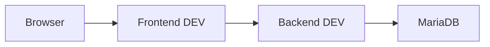
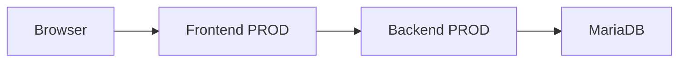

# Installations- und Betriebshandbuch

## Inhaltsverzeichnis

- [Installations- und Betriebshandbuch](#installations--und-betriebshandbuch)
  - [Inhaltsverzeichnis](#inhaltsverzeichnis)
  - [1. Zweck und Geltungsbereich](#1-zweck-und-geltungsbereich)
    - [1.1 Ziel des Dokuments](#11-ziel-des-dokuments)
    - [1.2 Zielgruppe](#12-zielgruppe)
    - [1.3 Abgrenzung zu anderen Dokumenten](#13-abgrenzung-zu-anderen-dokumenten)
  - [2. Systemübersicht](#2-systemübersicht)
    - [2.1 Zweck des Systems](#21-zweck-des-systems)
    - [2.2 Betriebsmodell](#22-betriebsmodell)
    - [2.3 Systemkomponenten](#23-systemkomponenten)
  - [3. Systemvoraussetzungen](#3-systemvoraussetzungen)
    - [3.1 Hardware](#31-hardware)
    - [3.2 Software](#32-software)
      - [Infrastrukturservices](#infrastrukturservices)
      - [Anwendungskomponenten](#anwendungskomponenten)
    - [3.3 Netzwerkzugang](#33-netzwerkzugang)
  - [4. Infrastrukturübersicht](#4-infrastrukturübersicht)
    - [4.1 Plattform](#41-plattform)
    - [4.2 Containerlandschaft](#42-containerlandschaft)
    - [4.3 Umgebungen](#43-umgebungen)
      - [DEV](#dev)
      - [TEST](#test)
      - [PROD](#prod)
  - [5. Docker-Netzwerkarchitektur](#5-docker-netzwerkarchitektur)
    - [5.1 EMC Hauptnetzwerk](#51-emc-hauptnetzwerk)
    - [5.2 Teilnehmer im EMC Hauptnetzwerk](#52-teilnehmer-im-emc-hauptnetzwerk)
    - [5.3 Kommunikationsmodell](#53-kommunikationsmodell)
      - [DEV](#dev-1)
      - [PROD](#prod-1)
      - [Architekturprinzip](#architekturprinzip)
    - [5.4 Infrastruktur-Netzwerke](#54-infrastruktur-netzwerke)
      - [mariadb\_default](#mariadb_default)
      - [uptime-kuma\_default](#uptime-kuma_default)
    - [5.5 Netzwerkgrundsätze](#55-netzwerkgrundsätze)
  - [6. Konfigurationsmanagement](#6-konfigurationsmanagement)
    - [6.1 Frontend Konfiguration](#61-frontend-konfiguration)
    - [6.2 Backend Konfiguration](#62-backend-konfiguration)
    - [6.3 Datenbank Konfiguration](#63-datenbank-konfiguration)
    - [6.4 Backup Konfiguration](#64-backup-konfiguration)
    - [6.5 Stack-Verwaltung](#65-stack-verwaltung)
    - [6.6 Konfigurationsgrundsätze](#66-konfigurationsgrundsätze)
  - [7. Erstinstallation](#7-erstinstallation)
    - [7.1 Installationsprinzip](#71-installationsprinzip)
    - [7.2 Docker Host vorbereiten](#72-docker-host-vorbereiten)
    - [7.3 Portainer bereitstellen](#73-portainer-bereitstellen)
    - [7.4 Netzwerke anlegen](#74-netzwerke-anlegen)
    - [7.5 Datenbank bereitstellen](#75-datenbank-bereitstellen)
    - [7.6 Backup-Service bereitstellen](#76-backup-service-bereitstellen)
    - [7.7 Backend bereitstellen](#77-backend-bereitstellen)
    - [7.8 Frontend bereitstellen](#78-frontend-bereitstellen)
    - [7.9 Monitoring bereitstellen](#79-monitoring-bereitstellen)
    - [7.10 Erstprüfung](#710-erstprüfung)
  - [8. Betriebsprozesse](#8-betriebsprozesse)
    - [8.1 Statusprüfung](#81-statusprüfung)
    - [8.2 Start von Diensten](#82-start-von-diensten)
    - [8.3 Stop von Diensten](#83-stop-von-diensten)
    - [8.4 Neustart](#84-neustart)
    - [8.5 Redeployment](#85-redeployment)
    - [8.6 Logprüfung](#86-logprüfung)
    - [8.7 Betriebsprüfung Frontend](#87-betriebsprüfung-frontend)
    - [8.8 Betriebsprüfung Backend](#88-betriebsprüfung-backend)
    - [8.9 Datenbankbetrieb](#89-datenbankbetrieb)
    - [8.10 Portainer Betrieb](#810-portainer-betrieb)
  - [9. Monitoring und Überwachung](#9-monitoring-und-überwachung)
    - [9.1 Überwachte Systeme](#91-überwachte-systeme)
    - [9.2 Frontend Monitoring](#92-frontend-monitoring)
    - [9.3 Backend Monitoring](#93-backend-monitoring)
    - [9.4 Infrastruktur Monitoring](#94-infrastruktur-monitoring)
    - [9.5 Monitoring Grenzen](#95-monitoring-grenzen)
    - [9.6 Benachrichtigungen](#96-benachrichtigungen)
    - [9.7 Monitoring Routine](#97-monitoring-routine)
  - [10. Backup-Konzept](#10-backup-konzept)
    - [10.1 Backup Strategie](#101-backup-strategie)
    - [10.2 Gesicherte Datenbanken](#102-gesicherte-datenbanken)
    - [10.3 Speicherort](#103-speicherort)
    - [10.4 Backup Rotation](#104-backup-rotation)
    - [10.5 Initialbackup](#105-initialbackup)
    - [10.6 Operative Backup Prüfung](#106-operative-backup-prüfung)
    - [10.7 Verantwortlichkeit](#107-verantwortlichkeit)
    - [10.8 Restore](#108-restore)
  - [11. Benutzer- und Administrationszugänge](#11-benutzer--und-administrationszugänge)
    - [11.1 NAS Administration](#111-nas-administration)
    - [11.2 Portainer Administration](#112-portainer-administration)
    - [11.3 Datenbankadministration](#113-datenbankadministration)
    - [11.4 MariaDB Direktzugriff](#114-mariadb-direktzugriff)
    - [11.5 Anwendungsadministration](#115-anwendungsadministration)
  - [12. Sicherheitsrahmen](#12-sicherheitsrahmen)
    - [12.1 Zugriffsmodell](#121-zugriffsmodell)
    - [12.2 Authentifizierung](#122-authentifizierung)
    - [12.3 Rollenmodell](#123-rollenmodell)
    - [12.4 Backend Exponierung](#124-backend-exponierung)
    - [12.5 Datenbankzugriff](#125-datenbankzugriff)
    - [12.6 CSRF Status](#126-csrf-status)
    - [12.7 Monitoring als Sicherheitsaspekt](#127-monitoring-als-sicherheitsaspekt)
  - [13. Wartung](#13-wartung)
    - [13.1 Regelmäßige Kontrollen](#131-regelmäßige-kontrollen)
    - [13.2 Container Wartung](#132-container-wartung)
    - [13.3 Docker Image Bereinigung](#133-docker-image-bereinigung)
    - [13.4 Datenbank Wartung](#134-datenbank-wartung)
    - [13.5 Backup Wartung](#135-backup-wartung)
    - [13.6 Benutzerpflege](#136-benutzerpflege)
    - [13.7 Wartung nach Änderungen](#137-wartung-nach-änderungen)
  - [14. Betriebsgrenzen und aktueller Status](#14-betriebsgrenzen-und-aktueller-status)
    - [14.1 Pilotbetriebsstatus](#141-pilotbetriebsstatus)
    - [14.2 Mehrbenutzerstatus](#142-mehrbenutzerstatus)
    - [14.3 Access Übergangsarchitektur](#143-access-übergangsarchitektur)
    - [14.4 Internetbetrieb](#144-internetbetrieb)
    - [14.5 Betriebsreife](#145-betriebsreife)
    - [14.6 Technische Weiterentwicklung](#146-technische-weiterentwicklung)

---

## 1. Zweck und Geltungsbereich

### 1.1 Ziel des Dokuments

Dieses Dokument beschreibt die Installation, den technischen Betrieb und die administrative Betreuung der EMC Mitgliederverwaltung.

Ziel ist eine nachvollziehbare technische Betriebsdokumentation für Installation, Betrieb, Wartung und Überwachung der Anwendung.

Das Dokument beschreibt den aktuell realisierten Betriebsstand einschließlich Übergangsarchitekturen.

---

### 1.2 Zielgruppe

Dieses Dokument richtet sich an technisch verantwortliche Personen.

Insbesondere:

- Systemadministration
- technische Projektverantwortliche
- Betreiber der NAS-/Docker-Infrastruktur
- zukünftige technische Nachfolger im Vereinsbetrieb

Es handelt sich nicht um ein Endanwenderhandbuch.

---

### 1.3 Abgrenzung zu anderen Dokumenten

Dieses Dokument beschreibt den technischen Betrieb.

Nicht Bestandteil:

| Thema | Dokument |
|------|----------|
| Systemarchitektur | `04-architektur.md` |
| Release / Deployment Prozesse | `02-deployment.md` |
| Benutzerbedienung | `03-benutzerhandbuch.md` |
| Fehlerbehebung / Recovery | `05-troubleshooting.md` |

---

## 2. Systemübersicht

### 2.1 Zweck des Systems

Die EMC Mitgliederverwaltung ist eine webbasierte Anwendung zur Verwaltung von Mitgliederdaten des EMC.

Ziel ist die schrittweise Ablösung der bisherigen Microsoft-Access-basierten operativen Mitgliederpflege.

Die Anwendung unterstützt aktuell:

- Mitgliederverwaltung
- Stammdatenpflege
- Kontaktdatenpflege
- Mitgliedschaftsverwaltung
- Datenschutzdaten
- Chorkleidungsverwaltung
- Benutzerverwaltung
- Rollen- und Rechteverwaltung

---

### 2.2 Betriebsmodell

Die Anwendung wird containerisiert auf einem NAS betrieben.

Betriebsmodell:

- Docker-basierter Betrieb
- Portainer-basierte Stack-Verwaltung
- getrennte DEV- und PROD-Umgebung
- zentrale MariaDB-Datenhaltung
- Monitoring via Uptime Kuma
- automatisierte Datenbank-Backups

Die Architektur befindet sich aktuell in einem produktivnahen Pilotbetrieb.

> [!NOTE]
> Die aktuelle Betriebsarchitektur enthält bewusst Übergangsstrukturen zur Microsoft-Access-Altwelt.

---

### 2.3 Systemkomponenten

Die Betriebsumgebung umfasst folgende Hauptkomponenten:

| Komponente | Funktion |
|----------|----------|
| Frontend DEV | React Webanwendung |
| Backend DEV | Spring Boot API |
| Frontend PROD | React Webanwendung |
| Backend PROD | Spring Boot API |
| MariaDB | zentrale Datenhaltung |
| mariadb-backup | automatisierte Datenbank-Backups |
| phpMyAdmin | Datenbankadministration |
| Uptime Kuma | Monitoring |
| Portainer | Container-/Stack-Verwaltung |

---

## 3. Systemvoraussetzungen

### 3.1 Hardware

Aktuelle Betriebsplattform:

```text
UGREEN DH2300 NAS
```

Erforderlich:

- Docker-fähige Hostplattform
- ausreichender Speicherplatz für Container, Images und Backups
- persistente Datenspeicherung
- stabile Netzwerkverbindung

---

### 3.2 Software

Aktuell eingesetzte Softwarekomponenten:

**Plattform**

- Docker
- Portainer
 
---

#### Infrastrukturservices

- MariaDB
- Uptime Kuma
- phpMyAdmin
- mariadb-backup

---

#### Anwendungskomponenten

Frontend:

- React 19
- Vite
- nginx

Backend:

- Java 21
- Spring Boot 3
- Spring Security

- JdbcTemplate

---


### 3.3 Netzwerkzugang

Aktueller Zugriff:

- lokales Netzwerk
- kontrollierter externer Zugriff je nach Betriebskonfiguration

Aktuell technisch möglich:

- Frontend-basierter Webzugriff
- VPN-basierter Zugriff

Perspektivisch geplant:

- Domain-basierter Zugriff
- Reverse Proxy
- HTTPS/TLS

Netzwerkvoraussetzungen:

- Zugriff auf NAS
- Docker Netzwerkkommunikation
- Zugriff auf veröffentlichte Frontend-Ports

---

## 4. Infrastrukturübersicht

### 4.1 Plattform

Die Anwendung läuft vollständig auf einer zentralen NAS-Plattform.

Aktuelle Plattform:

```text
UGREEN DH2300
```

Betriebsmodell:

- zentraler Container-Host
- Docker Runtime
- Stack-Verwaltung via Portainer

Die Anwendung ist nicht auf mehrere Hosts verteilt.

---

### 4.2 Containerlandschaft

Aktuell laufende Container:

| Container | Funktion |
|----------|----------|
| emc-mitglieder-frontend-dev | DEV Frontend |
| emc-mitglieder-backend-dev | DEV Backend |
| emc-mitglieder-frontend-prod | PROD Frontend |
| emc-mitglieder-backend-prod | PROD Backend |
| mariadb | zentrale Datenbank |
| mariadb-backup | Backup-Service |
| phpmyadmin | Datenbankadministration |
| uptime-kuma | Monitoring |
| portainer | Containerverwaltung |

---

### 4.3 Umgebungen

Die Anwendung unterscheidet drei technische Umgebungen.

#### DEV

Zweck:

- Entwicklung
- technische Validierung
- Vorstufe für Releases

Komponenten:

- DEV Frontend
- DEV Backend
- separate DEV Datenbank innerhalb gemeinsamer MariaDB Instanz

---

#### TEST

Zweck:

- automatisierte Backend Integration Tests

Komponenten:

- dedizierte Test-Datenbank
- keine dauerhaft laufenden Containerumgebung

Datenbank:

```text
emc_mitglieder_test
```

Zugriff:

```text
dedizierter technischer Datenbankbenutzer
```

---

#### PROD

Zweck:

- produktivnaher Pilotbetrieb
- operative Nutzung

Komponenten:

- PROD Frontend
- PROD Backend
- separate PROD Datenbank innerhalb gemeinsamer MariaDB Instanz

> [!NOTE]
> DEV, TEST und PROD teilen sich aktuell dieselbe MariaDB-Instanz, verwenden jedoch logisch getrennte Datenbanken.

---

## 5. Docker-Netzwerkarchitektur

Die EMC Mitgliederverwaltung verwendet mehrere Docker-Netzwerke mit klarer funktionaler Trennung.

---

### 5.1 EMC Hauptnetzwerk

Zentrales Betriebsnetzwerk:

```text
emc_net
```

Eigenschaften:

- Docker Bridge Netzwerk
- internes Anwendungsnetz
- Kommunikation zwischen EMC-Anwendungskomponenten

Technische Eigenschaften:

```text
Subnetz: 172.18.0.0/16
Typ: bridge
```

---

### 5.2 Teilnehmer im EMC Hauptnetzwerk

Aktuell angeschlossene Container:

- emc-mitglieder-frontend-dev
- emc-mitglieder-backend-dev
- emc-mitglieder-frontend-prod
- emc-mitglieder-backend-prod
- mariadb
- uptime-kuma

Dieses Netzwerk bildet das zentrale Kommunikationsnetz der EMC Anwendung.

---

### 5.3 Kommunikationsmodell

Die EMC Mitgliederverwaltung folgt einem klassischen mehrschichtigen Kommunikationsmodell.

Der Browser kommuniziert ausschließlich mit dem jeweiligen Frontend.

Die Frontends kommunizieren intern mit dem zugehörigen Backend.

Die Backends greifen auf die zentrale MariaDB-Instanz zu.

---

#### DEV

Kommunikationsfluss:



Zweck:

- Entwicklung
- Tests
- technische Validierung
- Vorstufe für produktive Releases

---

#### PROD

Kommunikationsfluss:



Zweck:

- produktivnaher Pilotbetrieb
- operative Nutzung

---

#### Architekturprinzip

Kommunikationsgrundsätze:

- kein direkter Browserzugriff auf das Backend
- keine direkte Frontend-Datenbankkommunikation
- Trennung von UI, Geschäftslogik und Datenhaltung
- DEV und PROD logisch getrennte Kommunikationspfade
- gemeinsame Nutzung der zentralen MariaDB-Infrastruktur

---

### 5.4 Infrastruktur-Netzwerke

Zusätzlich existieren weitere Docker-Netzwerke.

#### mariadb_default

Zweck:

Datenbanknahe Infrastruktur

Teilnehmer:

- mariadb
- phpmyadmin
- mariadb-backup

Dieses Netzwerk dient Datenbankadministration und Backup.

---

#### uptime-kuma_default

Zweck:

Monitoring-Infrastruktur

Teilnehmer:

- uptime-kuma

---

### 5.5 Netzwerkgrundsätze

Architekturprinzipien:

- Backend nicht direkt extern exponieren
- interne Containerkommunikation über Docker-Netzwerke
- funktionale Netzwerksegmentierung
- klare Trennung von Anwendungs- und Infrastrukturkommunikation
- kontrollierte Erreichbarkeit von Verwaltungsdiensten

Ziel:

- reduzierte Angriffsfläche
- klare Kommunikationsbeziehungen
- bessere Nachvollziehbarkeit der Infrastruktur
- vereinfachte Betriebsadministration

---

## 6. Konfigurationsmanagement

Die EMC Mitgliederverwaltung verwendet komponentenspezifische Konfiguration.

Die Konfiguration erfolgt container- und stackbasiert.

Die zentrale Verwaltungsoberfläche für die Konfiguration ist:

```text
Portainer
```

Konfigurationsänderungen erfolgen abhängig von Komponente und Betriebszweck.

---

### 6.1 Frontend Konfiguration

Das Frontend wird als statischer React Build über nginx ausgeliefert.

Konfigurationsorte:

- Frontend Docker Image
- nginx Konfiguration innerhalb des Containers
- Portainer Stack Definition

Zentrale technische Konfiguration:

```text
/etc/nginx/conf.d/default.conf
```

Aufgaben der Frontend-Konfiguration:

- Auslieferung der React SPA
- React Router Fallback Routing
- Reverse Proxy für API Requests

Aktuelle Proxy-Konfiguration:

DEV:

```text
proxy_pass http://emc-mitglieder-backend-dev:8080
```

PROD:

```text
proxy_pass http://emc-mitglieder-backend-prod:8080
```

Zweck:

- gleiche Browser-Origin
- Sessionbasierte Authentifizierung
- keine direkte Backend-Exponierung
- saubere DEV/PROD Trennung

---

### 6.2 Backend Konfiguration

Das Backend wird als Spring Boot Container betrieben.

Konfigurationsorte:

- Spring Boot Konfiguration
- Container Environment Variablen
- Portainer Stack Definition

Typische Konfigurationsbereiche:

- Datenbankverbindung
- Spring Profile
- Logging
- Sicherheitskonfiguration
- Session-Verhalten

Umgebungen:

- DEV
- PROD

Betriebsrelevante Änderungen erfolgen primär über die Stack-Konfiguration.

---

### 6.3 Datenbank Konfiguration

MariaDB dient als zentrale Datenplattform.

Aktuelle Datenbanken:

| Umgebung | Datenbank |
|---------|-----------|
| DEV | emc_mitglieder_dev |
| TEST | emc_mitglieder_test |
| PROD | emc_mitglieder |

Zusätzlich vorhanden:

- emc_finanzen
- emc_finanzen_dev

Konfigurationsbereiche:

- Datenbanken
- Benutzer
- Berechtigungen
- Netzwerkzugriff

Verwaltung über:

```text
phpMyAdmin
```

oder technische Direktzugriffe.

Für automatisierte Backend Integration Tests existiert ein dedizierter technischer Datenbankbenutzer mit Zugriff ausschließlich auf die Test-Datenbank.

---

### 6.4 Backup Konfiguration

Automatisierte Datenbank-Backups erfolgen über:

```text
fradelg/mysql-cron-backup
```

Container:

```text
mariadb-backup
```

Konfigurationsort:

Portainer Stack Definition

Aktuelle Parameter:

| Parameter | Wert |
|---------|------|
| MYSQL_HOST | mariadb |
| MYSQL_PORT | 3306 |
| Zeitplan | täglich 03:00 |
| Initial Backup | aktiviert |
| Retention | 14 Backups |
| Kompression | gzip Level 6 |

Gesicherte Datenbanken:

- emc_mitglieder
- emc_mitglieder_dev
- emc_finanzen
- emc_finanzen_dev

Speicherort:

```text
/volume1/home/JaitiNissi1968/docker/backups/mariadb
```

---

### 6.5 Stack-Verwaltung

Die technische Betriebsstrategie basiert auf:

```text
Portainer Stacks
```

Stacks verwalten:

- Frontend DEV
- Backend DEV
- Frontend PROD
- Backend PROD
- MariaDB Infrastruktur
- Backup Infrastruktur
- Monitoring

Stack-Konfiguration umfasst typischerweise:

- Images
- Ports
- Netzwerke
- Volumes
- Environment Variablen
- Restart Policies

Konfigurationsänderungen erfolgen bevorzugt über Portainer.

---

### 6.6 Konfigurationsgrundsätze

Betriebsgrundsätze:

- DEV und PROD strikt getrennt konfigurieren
- Konfigurationsänderungen kontrolliert durchführen
- Änderungen nach Umsetzung prüfen
- Stack-basierte Konfiguration bevorzugen
- direkte Containermanipulation vermeiden

> [!NOTE]
> Konfigurationsänderungen an laufenden Containern ohne Stack-Anpassung sind nicht dauerhaft und gehen beim Redeployment verloren.

---

## 7. Erstinstallation

Dieses Kapitel beschreibt die grundsätzliche technische Erstinstallation.

Release- und Update-Prozesse werden separat im Deployment-Handbuch beschrieben.

---

### 7.1 Installationsprinzip

Die aktuelle Betriebsumgebung ist historisch gewachsen.

Die folgende Reihenfolge beschreibt eine technisch sinnvolle logische Erstinstallation, nicht zwingend den historisch realen Aufbau.

Installationsreihenfolge:

1. Docker Host bereitstellen
2. Portainer bereitstellen
3. Docker Netzwerke anlegen
4. MariaDB bereitstellen
5. Backup-Service bereitstellen
6. Backend Stacks bereitstellen
7. Frontend Stacks bereitstellen
8. Monitoring bereitstellen
9. Funktionsprüfung durchführen

---

### 7.2 Docker Host vorbereiten

Erforderlich:

- betriebsbereiter Docker Host
- persistente Speicherbereiche
- Netzwerkzugriff
- Docker Runtime

Aktuelle Plattform:

```text
UGREEN DH2300
```

---

### 7.3 Portainer bereitstellen

Portainer dient als zentrale Verwaltungsoberfläche.

Funktion:

- Stack Deployment
- Containerverwaltung
- Logs
- Neustarts
- Statuskontrolle

Aktueller Zugriff:

```text
Port 9000
```

---

### 7.4 Netzwerke anlegen

Erforderliche Netzwerke:

```text
emc_net
mariadb_default
uptime-kuma_default
```

Je nach Installationsstrategie können Netzwerke automatisch oder manuell erzeugt werden.

---

### 7.5 Datenbank bereitstellen

MariaDB bereitstellen mit:

- persistentem Volume
- interner Netzwerkkommunikation
- Portfreigabe für interne Altprozesse

Aktuell bewusst veröffentlicht:

```text
3306
```

Grund:

Microsoft Access / ODBC Übergangsarchitektur

> [!WARNING]
> Port 3306 darf nicht öffentlich ins Internet veröffentlicht werden.

---

### 7.6 Backup-Service bereitstellen

Backup-Container bereitstellen:

```text
mariadb-backup
```

Anforderungen:

- Zugriff auf MariaDB
- persistenter Backup-Speicher
- Cron Scheduling
- Aufbewahrungsstrategie

Funktionsprüfung:

- Initialbackup vorhanden
- Backupdateien erzeugt
- Rotation funktioniert

---

### 7.7 Backend bereitstellen

Backend-Deployment:

- DEV Stack
- PROD Stack

Anforderungen:

- Datenbankzugriff
- interne Netzwerkkommunikation
- korrekte Umgebungsparameter

Backend wird nicht direkt extern veröffentlicht.

---

### 7.8 Frontend bereitstellen

Frontend-Deployment:

- DEV Frontend
- PROD Frontend

Anforderungen:

- nginx Konfiguration
- API Proxy
- React Build Artefakte

Aktuelle veröffentlichte Ports:

| Umgebung | Port |
|---------|------|
| DEV | 8082 |
| PROD | 9082 |

---

### 7.9 Monitoring bereitstellen

Monitoring via:

```text
Uptime Kuma
```

Einzurichten:

- Frontend Checks
- Backend Checks
- Datenbank Checks
- Infrastruktur Checks
- Telegram Benachrichtigung

---

### 7.10 Erstprüfung

Nach Installation prüfen:

- alle Container laufen
- Portainer erreichbar
- Frontends erreichbar
- Login funktioniert
- Backend erreichbar
- Datenbank erreichbar
- Monitoring aktiv
- Backup erzeugt

> [!NOTE]
> Release Smoke Tests werden im Deployment-Handbuch detailliert beschrieben.

---

## 8. Betriebsprozesse

Dieses Kapitel beschreibt typische operative Betriebsabläufe.

Die primäre Verwaltungsoberfläche ist:

```text
Portainer
```

Docker CLI dient ergänzend für Diagnose, Spezialfälle und Recovery.

---

### 8.1 Statusprüfung

Regelmäßige Statuskontrolle umfasst:

- Containerstatus
- Stackstatus
- Erreichbarkeit der Webanwendung
- Monitoring Status
- Backup Status

Portainer:

- Stack Übersicht
- Container Status
- Neustarts
- Logs
- Netzwerke
- Volumes

Docker CLI:

```bash
docker ps
```

Zweck:

- laufende Container prüfen
- Portfreigaben prüfen
- unerwartete Neustarts erkennen

---

### 8.2 Start von Diensten

Im Regelbetrieb starten Container automatisch.

Konfiguration:

```text
restart: unless-stopped
```

Manueller Start:

Portainer:

- Stack starten
- Container starten

Docker CLI:

```bash
docker start <container>
```

oder:

```bash
docker compose up -d
```

CLI-Befehle dienen primär Diagnose- oder Spezialfällen außerhalb der regulären Stack-Verwaltung.

---

### 8.3 Stop von Diensten

Geplanter Stop:

Portainer:

- Stack stoppen
- Container stoppen

Docker CLI:

```bash
docker stop <container>
```

oder:

```bash
docker compose down
```

CLI-Befehle dienen primär Diagnose- oder Spezialfällen außerhalb der regulären Stack-Verwaltung.

---

### 8.4 Neustart

Typische Anwendungsfälle:

- Konfigurationsänderungen
- Deployment
- Recovery
- Netzwerkprobleme
- Containerfehler

Portainer:

- Restart Container
- Redeploy Stack

Docker CLI:

```bash
docker restart <container>
```

---

### 8.5 Redeployment

Da die Betriebsarchitektur stackbasiert organisiert ist, erfolgen Konfigurationsänderungen bevorzugt über Redeployment.

Typische Anwendungsfälle:

- Image Updates
- Environment Variablen Änderungen
- Portänderungen
- Netzwerkänderungen
- Volume Anpassungen
- Containerdefinitionen ändern

Portainer Vorgehen:

1. Stack öffnen
2. Konfiguration prüfen oder anpassen
3. Redeploy ausführen
4. Containerstatus prüfen
5. Funktionstest durchführen

Nach Redeployment prüfen:

- Container laufen
- Frontend erreichbar
- Login funktioniert
- API erreichbar
- Monitoring grün

> [!NOTE]
> Änderungen direkt innerhalb laufender Container sind nicht dauerhaft und gehen beim Redeployment verloren.

---

### 8.6 Logprüfung

Logs sind zentrale Diagnosequelle.

Portainer:

integrierte Logansicht

Docker CLI:

```bash
docker logs <container>
```

Live Log:

```bash
docker logs -f <container>
```

Typische Kandidaten:

- emc-mitglieder-backend-dev
- emc-mitglieder-backend-prod
- emc-mitglieder-frontend-dev
- emc-mitglieder-frontend-prod
- mariadb
- mariadb-backup
- uptime-kuma

---

### 8.7 Betriebsprüfung Frontend

Prüfen:

- Frontend erreichbar
- Loginseite lädt
- Navigation funktioniert
- Sessionverhalten korrekt

Aktuelle Zugriffe:

DEV:

```text
http://<NAS-IP>:8082
```

PROD:

```text
http://<NAS-IP>:9082
```

---

### 8.8 Betriebsprüfung Backend

Backend ist nicht direkt extern veröffentlicht.

Prüfung erfolgt indirekt:

- Frontend Funktion
- Uptime Kuma
- Backend Logs

Bewusst erwartetes Verhalten:

```text
HTTP 401 Unauthorized
```

ohne Authentifizierung.

---

### 8.9 Datenbankbetrieb

Regelmäßig prüfen:

- MariaDB Container läuft
- Portfreigabe vorhanden
- DB Verbindungen stabil
- keine Fehlereinträge

Port:

```text
3306
```

---

### 8.10 Portainer Betrieb

Portainer dient als zentrale Betriebsoberfläche.

Funktionen:

- Stack Verwaltung
- Container Status
- Logs
- Neustarts
- Redeployments
- Netzwerkübersicht
- Volume Übersicht

Aktueller Zugriff:

```text
http://<NAS-IP>:9000
```

---

## 9. Monitoring und Überwachung

Monitoring erfolgt über:

```text
Uptime Kuma
```

---

### 9.1 Überwachte Systeme

Aktuell überwacht:

- Frontend DEV
- Frontend PROD
- Backend DEV
- Backend PROD
- MariaDB
- phpMyAdmin
- Portainer
- mariadb-backup

---

### 9.2 Frontend Monitoring

Frontend Checks prüfen:

- HTTP Erreichbarkeit
- nginx Funktion
- Webanwendung erreichbar

Erwartung:

```text
HTTP 200
```

---

### 9.3 Backend Monitoring

Backend Monitoring erfolgt bewusst über geschützte Endpunkte.

Erwartetes Ergebnis:

```text
HTTP 401 Unauthorized
```

Dies gilt als erfolgreiches Monitoring-Ergebnis.

Interpretation:

- Backend erreichbar
- Spring Security aktiv
- API reagiert erwartungsgemäß

> [!NOTE]
> HTTP 401 ist hier kein Fehlerzustand.

---

### 9.4 Infrastruktur Monitoring

Überwachung:

- MariaDB
- phpMyAdmin
- Portainer
- Backup Container

Ziele:

- Erreichbarkeit
- Dienststatus
- Ausfälle erkennen

---

### 9.5 Monitoring Grenzen

Monitoring prüft primär:

- Dienstverfügbarkeit
- Erreichbarkeit
- grundlegende Betriebsbereitschaft

Monitoring prüft nicht automatisch:

- fachliche Korrektheit
- Datenintegrität
- erfolgreiche inhaltliche Backup-Wiederherstellbarkeit

> [!WARNING]
> Ein laufender Dienst bedeutet nicht automatisch einen fachlich korrekten Systemzustand.

---

### 9.6 Benachrichtigungen

Benachrichtigung erfolgt via:

```text
Telegram
```

Zweck:

- schnelle Ausfallinformation
- Betriebsüberwachung
- Alarmierung

---

### 9.7 Monitoring Routine

Empfohlene regelmäßige Prüfung:

- Uptime Kuma Dashboard
- fehlgeschlagene Checks
- unerwartete Neustarts
- Telegram Alerts
- Erreichbarkeit Frontend

---

## 10. Backup-Konzept

Die Anwendung verwendet automatisierte Datenbank-Backups.

Technologie:

```text
fradelg/mysql-cron-backup
```

Container:

```text
mariadb-backup
```

---

### 10.1 Backup Strategie

Backup-Modell:

- automatisiert
- dateibasiert
- containerisiert
- komprimiert
- rotationsbasiert

Aktuelle Parameter:

| Parameter | Wert |
|---------|------|
| Zeitplan | täglich 03:00 |
| Initialbackup | aktiviert |
| Retention | 14 Backups |
| Kompression | gzip Level 6 |

---

### 10.2 Gesicherte Datenbanken

Aktuell enthalten:

- emc_mitglieder
- emc_mitglieder_dev
- emc_finanzen
- emc_finanzen_dev

> [!NOTE]
> Das Backup-Konzept umfasst aktuell mehrere EMC-bezogene Anwendungen, nicht ausschließlich die Mitgliederverwaltung.

---

### 10.3 Speicherort

Aktueller Backup Speicher:

```text
/volume1/home/JaitiNissi1968/docker/backups/mariadb
```

Dieser Pfad ist installationsabhängig.

Anforderungen:

- persistenter Speicher
- ausreichender freier Platz
- NAS-seitige Datensicherheit

---

### 10.4 Backup Rotation

Retention:

```text
14 Backups
```

Bedeutung:

- ältere Backups werden automatisch entfernt
- begrenzter Speicherverbrauch
- definierte Aufbewahrung

---

### 10.5 Initialbackup

Beim Start des Backup Containers:

```text
INIT_BACKUP=1
```

Bedeutung:

Sofortiger Initialdump beim Containerstart.

Vorteil:

Backup-Sicherheit direkt nach Deployment oder Neustart.

---

### 10.6 Operative Backup Prüfung

Regelmäßig prüfen:

- Backupdateien vorhanden
- aktuelles Datum vorhanden
- Dateigröße plausibel
- Rotation funktioniert
- Backup Container läuft

Prüfung via:

Portainer:

- Container Status
- Logs

Docker CLI:

```bash
docker logs mariadb-backup
```

NAS Dateisystem:

Backup Verzeichnis prüfen

---

### 10.7 Verantwortlichkeit

Der technische Betreiber ist verantwortlich für:

- Backup Funktionsprüfung
- Speicherplatzkontrolle
- Rotation Kontrolle
- Backup Integrität

---

### 10.8 Restore

Restore-Prozesse werden detailliert im Troubleshooting-/Recovery-Handbuch beschrieben.

> [!WARNING]
> Ein Backup ohne getesteten Restore ist kein vollständiges Betriebskonzept.

---

## 11. Benutzer- und Administrationszugänge

Dieses Kapitel beschreibt technische und administrative Zugänge zum Betriebssystem.

Die fachliche Benutzerverwaltung der Anwendung selbst wird separat im Benutzerhandbuch beschrieben.

---

### 11.1 NAS Administration

Zentraler technischer Zugang:

```text
UGREEN DH2300 NAS
```

Typische Verwaltungsaufgaben:

- Hostverwaltung
- Speicherverwaltung
- Netzwerkverwaltung
- Benutzerverwaltung
- Plattformüberwachung

Zugang:

- NAS Webadministration
- SSH Zugriff

---

### 11.2 Portainer Administration

Portainer ist die primäre technische Betriebsoberfläche.

Aktueller Zugriff:

```text
http://<NAS-IP>:9000
```

Funktionen:

- Stack Verwaltung
- Container Neustarts
- Redeployments
- Logs
- Statuskontrolle
- Netzwerkübersicht
- Volumes

Zielgruppe:

- technische Betreiber
- Administratoren

---

### 11.3 Datenbankadministration

Datenbankadministration erfolgt über:

```text
phpMyAdmin
```

Aktueller Zugriff:

```text
http://<NAS-IP>:8080
```

Typische Aufgaben:

- Read-Only Prüfungen bevorzugt
- Datenprüfung
- SQL Abfragen
- technische Analyse
- Tabellenprüfung
- Strukturkontrolle

> [!WARNING]
> Direkte produktive Datenänderungen sollten ausschließlich im Ausnahmefall und mit technischer Sorgfalt erfolgen.

---

### 11.4 MariaDB Direktzugriff

Technischer Direktzugriff möglich über:

```text
Port 3306
```

Aktueller Zweck:

- Microsoft Access ODBC Übergangsarchitektur
- technische Administration
- Spezialfälle

> [!WARNING]
> Direkter Datenbankzugriff umgeht Anwendungslogik, Validierung und Berechtigungsregeln.

---

### 11.5 Anwendungsadministration

Innerhalb der EMC Anwendung existiert eine fachliche Benutzerverwaltung.

Administrierbar:

- Benutzer anlegen
- Rollen ändern
- aktiv/inaktiv setzen
- Passwort setzen

Rollen:

- ADMIN
- EDITOR
- VIEWER

---

## 12. Sicherheitsrahmen

Dieses Kapitel beschreibt den aktuellen operativen Sicherheitsrahmen.

Die technische Sicherheitsarchitektur wird detailliert in:

```text
04-architektur.md
```

beschrieben.

---

### 12.1 Zugriffsmodell

Aktueller Zugriff:

- internes Netzwerk
- kontrollierter externer Zugriff abhängig von Betriebskonfiguration

Die Anwendung ist derzeit nicht für offenen Internetbetrieb ausgelegt.

---

### 12.2 Authentifizierung

Authentifizierung erfolgt über:

```text
Spring Security Sessions
```

Merkmale:

- serverseitige Sessionverwaltung
- HttpOnly Session Cookie
- Session Restore
- serverseitige Autorisierung

---

### 12.3 Rollenmodell

Verwendete Rollen:

- ADMIN
- EDITOR
- VIEWER

Prinzip:

Minimal notwendige Rechtevergabe.

---

### 12.4 Backend Exponierung

Die Spring Boot Backends sind nicht direkt extern veröffentlicht.

Zugriff erfolgt ausschließlich indirekt über:

```text
nginx Frontend Reverse Proxy
```

Dies reduziert die externe Angriffsfläche.

---

### 12.5 Datenbankzugriff

MariaDB ist aktuell im internen Netz erreichbar.

Port:

```text
3306
```

Begründung:

- Access Übergangsarchitektur
- ODBC Altprozesse
- technische Administration

Risiko:

Direkter DB Zugriff umgeht:

- Validierung
- Berechtigungslogik
- Geschäftsregeln

---

### 12.6 CSRF Status

Aktueller Status:

```text
deaktiviert
```

Dies ist im aktuellen Pilotbetrieb bewusst akzeptiert.

Begründung:

- kontrollierter Pilotbetrieb
- sessionbasierte Webanwendung
- begrenzter Benutzerkreis
- Backend nicht direkt extern exponiert

> [!WARNING]
> Bei echtem Internetbetrieb ist eine Neubewertung erforderlich.

---

### 12.7 Monitoring als Sicherheitsaspekt

Monitoring unterstützt Sicherheits- und Betriebsstabilität.

Überwachung:

- Erreichbarkeit
- Ausfälle
- unerwartete Neustarts

Benachrichtigung:

```text
Telegram Alerts
```

---

## 13. Wartung

Dieses Kapitel beschreibt regelmäßige technische Wartungsaufgaben.

---

### 13.1 Regelmäßige Kontrollen

Empfohlen:

täglich / regelmäßig:

- Uptime Kuma Status prüfen
- Containerstatus prüfen
- Backupprüfung
- freie Speicherressourcen prüfen
- Telegram Alerts prüfen

---

### 13.2 Container Wartung

Typische Aufgaben:

- Neustarts
- Image Updates
- Stack Redeployments
- Logkontrolle

Primär via:

```text
Portainer
```

---

### 13.3 Docker Image Bereinigung

Langfristig entstehen durch Redeployments und Updates alte Docker Images.

Regelmäßig prüfen:

- nicht mehr verwendete Images
- dangling images
- unnötiger Speicherverbrauch

Typische CLI Prüfung:

```bash
docker image ls
```

Bereinigung bei Bedarf:

```bash
docker image prune
```

oder kontrolliert manuell via Portainer.

> [!NOTE]
> Image Bereinigung sollte bewusst erfolgen, um benötigte Rollback-Stände nicht unbeabsichtigt zu entfernen.

---

### 13.4 Datenbank Wartung

Typische Aufgaben:

- DB Verfügbarkeit prüfen
- Tabellenzustand prüfen
- Backupkontrolle
- Speicherplatzprüfung
- Benutzer- und Rechteprüfung

Werkzeuge:

- phpMyAdmin
- Docker Logs
- MariaDB Direktzugriff

---

### 13.5 Backup Wartung

Regelmäßig prüfen:

- aktuelle Backups vorhanden
- Rotation funktioniert
- Speicherplatz ausreichend
- Backup Container läuft

---

### 13.6 Benutzerpflege

Regelmäßige fachliche Aufgaben:

- Benutzerkonten pflegen
- Rollen prüfen
- inaktive Benutzer deaktivieren
- Passwortpflege

---

### 13.7 Wartung nach Änderungen

Nach technischen Änderungen prüfen:

- Containerstatus
- Login
- Frontend Erreichbarkeit
- Backend Verhalten
- Monitoring
- Backup Status

---

## 14. Betriebsgrenzen und aktueller Status

Dieses Kapitel dokumentiert bewusst die aktuelle Realität des Systems.

---

### 14.1 Pilotbetriebsstatus

Aktueller Status:

- produktivnaher Pilotbetrieb
- technische DEV/PROD Trennung vorhanden
- reale operative Nutzung vorhanden

---

### 14.2 Mehrbenutzerstatus

Aktuell:

Aktuell:

- technisch Mehrbenutzer-fähig
- operativ derzeit faktisch Einzelanwenderbetrieb

Perspektivisch:

- Mehrbenutzerbetrieb

---

### 14.3 Access Übergangsarchitektur

Microsoft Access ist noch nicht vollständig abgelöst.

Aktuell verbleiben:

- ODBC-basierte Altprozesse
- Berichtswesen / Auswertungen
- direkte Datenbankzugriffe

Die Web-Anwendung ersetzt schrittweise die operative Pflege.

---

### 14.4 Internetbetrieb

Aktueller Status:

kein echter offener Internetbetrieb

Geplante Entwicklung:

- Domain Zugriff
- DynDNS
- Reverse Proxy
- HTTPS/TLS

---

### 14.5 Betriebsreife

Aktueller Reifegrad:

MVP / produktivnaher Pilotbetrieb

Konsequenzen:

- pragmatische Architekturentscheidungen
- bewusst akzeptierte Übergangsstrukturen
- schrittweise Professionalisierung

---

### 14.6 Technische Weiterentwicklung

Geplante Weiterentwicklung:

- Security Härtung
- Internetzugriff
- verbesserte Recovery Prozesse
- professioneller Mehrbenutzerbetrieb
- vollständige Access Ablösung