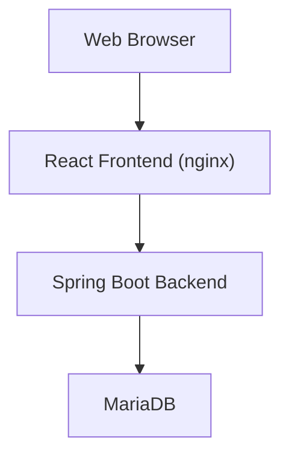
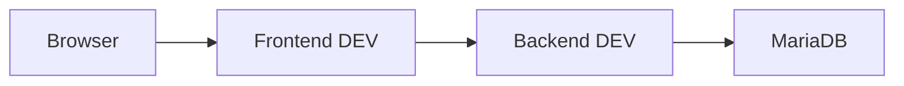
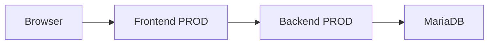
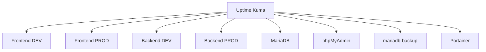
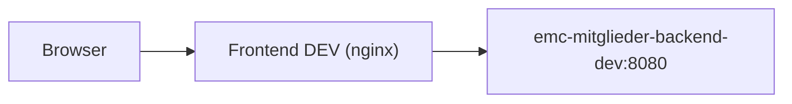
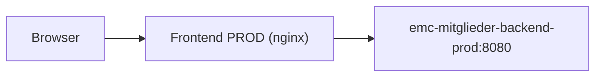

# Architekturübersicht

## Ziel und Zweck

### Projektziel

Die EMC Mitgliederverwaltung ist eine moderne webbasierte Anwendung zur Verwaltung der Mitgliederdaten des EMC.

Ziel des Projekts ist die schrittweise Ablösung der bisherigen Microsoft-Access-basierten operativen Mitgliederpflege durch eine wartbare, sichere und rollenbasierte Web-Anwendung.

Die Anwendung stellt eine browserbasierte Arbeitsoberfläche für die Mitgliederverwaltung bereit und bildet zentrale Vereinsprozesse in einer modernen Client-Server-Architektur ab.

---

### Ausgangssituation

Historisch erfolgt die Mitgliederverwaltung über eine Microsoft Access Anwendung.

Bisherige Nutzung:

- operative Datenpflege in Microsoft Access
- Berichte und Auswertungen in Access
- direkter Datenbankzugriff über ODBC

Einschränkungen der bisherigen Lösung:

- eingeschränkte Mehrbenutzerfähigkeit
- komplexe Bereitstellung für externe Nutzer
- Abhängigkeit von VPN und lokaler Client-Konfiguration
- eingeschränkte Wartbarkeit
- enge Kopplung zwischen Benutzeroberfläche und Datenhaltung

Die neue Web-Anwendung ersetzt schrittweise die operative Pflege.

Die bestehende Access-Lösung bleibt zunächst für bestimmte Berichts- und Auswertungsfunktionen weiterhin im Einsatz.

> [!NOTE]
> Die vollständige Ablösung der Access-Anwendung ist perspektivisch vorgesehen, jedoch nicht Bestandteil des aktuellen Projektumfangs.

---

### Aktueller Betriebsstatus

Die Anwendung befindet sich aktuell in einem produktivnahen Pilotbetrieb.

Aktueller Status:

- DEV Umgebung vollständig vorhanden
- PROD Umgebung technisch bereitgestellt
- produktive Nutzung aktuell durch Einzelanwender
- operative Nutzung bereits teilweise über die Web-Anwendung
- Microsoft Access weiterhin ergänzend im Einsatz

Die Lösung ist damit noch kein vollständig ausgerollter Mehrbenutzer-Produktivbetrieb.

---

### Fachlicher Funktionsumfang

Aktuell umgesetzt:

- Mitgliederliste
- Suche
- Filterung
- Detailansicht
- Stammdatenpflege
- Kontaktdatenpflege
- Mitgliedschaftspflege
- Datenschutz (MVP-artig)
- Chorkleidung
- Benutzerverwaltung
- Rollen- und Rechteverwaltung

Geplante Erweiterungen:

- Ehrungen
- Funktionen
- Verteiler
- vollständige Access-Ablösung

---

## Fachliche Systemübersicht

Die Anwendung bildet die fachliche Mitgliederverwaltung des EMC ab.

Zentrales fachliches Objekt ist das **Mitglied**.

Ein Mitglied umfasst mehrere logisch getrennte Verwaltungsbereiche.

---

### Stammdaten

Beinhaltet allgemeine Personendaten:

- Anrede
- akademischer Titel
- Vorname
- Nachname
- Geburtsdatum
- Straße / Hausnummer
- Postleitzahl
- Ort

---

### Kontaktdaten

Beinhaltet Kommunikationsdaten:

- Telefon privat
- Telefon geschäftlich
- Mobiltelefon
- E-Mail
- Adresszusatz
- Briefanrede

---

### Mitgliedschaft

Beinhaltet vereinsbezogene Zuordnungen:

- Eintritt
- Austritt
- Mitgliederstatus
- Stimme
- Kammerchor-Zugehörigkeit

---

### Datenschutz

Der Bereich Datenschutz bildet MVP-artig datenschutzbezogene Angaben zum Mitglied ab.

Dazu gehören strukturierte Informationen, die innerhalb der Mitgliederverwaltung für datenschutzbezogene Kennzeichnungen oder Einwilligungen relevant sind.

> [!NOTE]
> Dieser Bereich ersetzt kein vollständiges Datenschutz- oder DSGVO-Managementsystem.

---

### Chorkleidung

Der Bereich Chorkleidung dient der Verwaltung chorspezifischer Kleidungsinformationen.

Beispielsweise:

- Kleidungsstatus
- Kauf-/Verwaltungsinformationen
- organisatorische Zuordnungen

---

### Benutzerverwaltung

Administratoren können Benutzerkonten innerhalb der Anwendung verwalten.

Funktionen:

- Benutzer anlegen
- Rollen ändern
- Benutzer aktiv/inaktiv setzen
- Passwort setzen
- letzte Anmeldung einsehen

---

### Rollenmodell

Das System verwendet ein rollenbasiertes Berechtigungsmodell.

Verfügbare Rollen:

- `ADMIN`
- `EDITOR`
- `VIEWER`

Rechte werden sowohl im Backend als auch im Frontend durchgesetzt.

---

## Technische Gesamtarchitektur

Die Anwendung folgt einer klassischen mehrschichtigen Web-Anwendungsarchitektur mit klarer Trennung von Präsentation, Geschäftslogik und Datenhaltung.

### High-Level Architektur



---

### Architekturprinzipien

Die Architektur basiert auf folgenden Grundprinzipien:

- browserbasierter Zugriff
- kein direkter Datenbankzugriff aus dem Frontend
- REST-basierte Kommunikation
- serverseitige Authentifizierung
- rollenbasierte Autorisierung
- containerisierter Betrieb via Docker
- gemeinsame Infrastruktur auf NAS

---

### Betriebsunterstützende Komponenten

Zusätzlich zur Kernanwendung existieren unterstützende Betriebsdienste:

- Uptime Kuma
- phpMyAdmin
- Portainer
- Backup-Service
- Telegram Benachrichtigungen

---

## Komponentenübersicht

## Frontend

### Technologie

- React 19
- Vite
- React Router
- React Query
- React Hook Form
- Vitest

### Verantwortlichkeiten

Das Frontend übernimmt:

- Benutzeroberfläche
- Navigation / Routing
- Formularlogik
- clientseitige Validierung
- Auto-Save Steuerung
- rollenabhängige UI-Steuerung

### Deployment

Das Frontend wird als statischer React Build erzeugt und über nginx innerhalb eines Docker-Containers ausgeliefert.

---

## Backend

### Technologie

- Java 21
- Spring Boot 3
- Spring Security
- JdbcTemplate
- Maven

### Verantwortlichkeiten

Das Backend übernimmt:

- REST API
- Geschäftslogik
- serverseitige Validierung
- Authentifizierung
- Autorisierung
- Datenbankzugriff
- Fehlerbehandlung

---

## Datenbank

### Technologie

- MariaDB

### Verantwortlichkeiten

Die Datenbank übernimmt:

- operative Datenspeicherung
- Mitgliederdaten
- Benutzerdaten
- Lookup-Daten
- Datenintegrität
- relationale Constraints

DEV und PROD nutzen getrennte Datenbanken innerhalb derselben MariaDB-Instanz.

Aktuell:

- `emc_mitglieder`
- `emc_mitglieder_dev`

---

## Infrastruktur

### Plattform

- UGREEN NAS

### Containerplattform

- Docker

### Zusatzkomponenten

- Uptime Kuma
- phpMyAdmin
- Portainer
- mariadb-backup

---

## Container- und Infrastrukturarchitektur

### Laufende EMC-Anwendungscontainer

| Container | Funktion |
|---------|----------|
| emc-mitglieder-frontend-dev | DEV Frontend |
| emc-mitglieder-backend-dev | DEV Backend |
| emc-mitglieder-frontend-prod | PROD Frontend |
| emc-mitglieder-backend-prod | PROD Backend |

---

### Datenhaltungscontainer

| Container | Funktion |
|---------|----------|
| mariadb | zentrale Datenbank |
| mariadb-backup | Backup-Service |

---

### Betriebs- und Administrationscontainer

| Container | Funktion |
|---------|----------|
| phpmyadmin | Datenbankadministration |
| uptime-kuma | Monitoring |
| portainer | Containerverwaltung / Deployment-Unterstützung |

---

### Exponierte Ports

| Dienst | Port |
|------|------|
| DEV Frontend | 8082 |
| PROD Frontend | 9082 |
| phpMyAdmin | 8080 |
| MariaDB | 3306 |
| Uptime Kuma | 3001 |
| Portainer | 9000 |

> [!NOTE]
> Die Spring Boot Backends sind nicht direkt extern veröffentlicht.

---

## Docker-Netzwerkarchitektur

### EMC Hauptnetzwerk

Docker Hauptnetzwerk:

```text
emc_net
```

Eigenschaften:

- Typ: `bridge`
- Subnetz: `172.18.0.0/16`

---

### Mitglieder des EMC Netzwerks

Teil des Netzwerks:

- emc-mitglieder-frontend-dev
- emc-mitglieder-backend-dev
- emc-mitglieder-frontend-prod
- emc-mitglieder-backend-prod
- mariadb
- uptime-kuma

---

### Kommunikationsbeziehungen

#### DEV



---

#### PROD



---

### Monitoring-Kommunikation



> [!NOTE]
> Backend-Monitoring erfolgt bewusst über unauthentifizierte Requests, die erwartungsgemäß HTTP 401 Unauthorized zurückgeben. Dies wird als positives Lebenszeichen des gesicherten Backends gewertet.

---

### Weitere Docker-Netzwerke

Zusätzlich vorhanden:

#### mariadb_default

Enthält:

- mariadb
- phpmyadmin
- mariadb-backup

---

#### uptime-kuma_default

Enthält:

- uptime-kuma

---

## Frontend-Backend-Kommunikation

Die Frontends kommunizieren nicht direkt vom Browser zum Backend, sondern über nginx als Reverse Proxy innerhalb des jeweiligen Frontend-Containers.

### DEV



---

### PROD



Technische Umsetzung:

- React SPA Auslieferung über nginx
- API Routing über `/api/`
- Weiterleitung via `proxy_pass`

Vorteile:

- keine direkte Backend-Exponierung
- saubere DEV/PROD Trennung
- vereinfachte Browser-Kommunikation
- zentrale Proxy-Steuerung