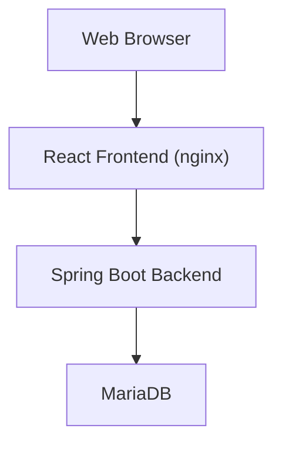
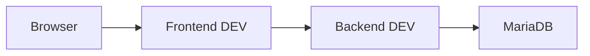
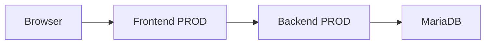
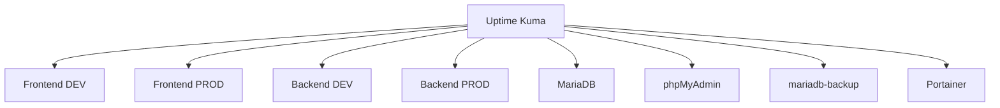
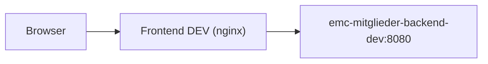
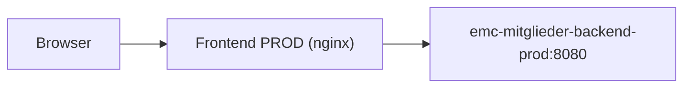
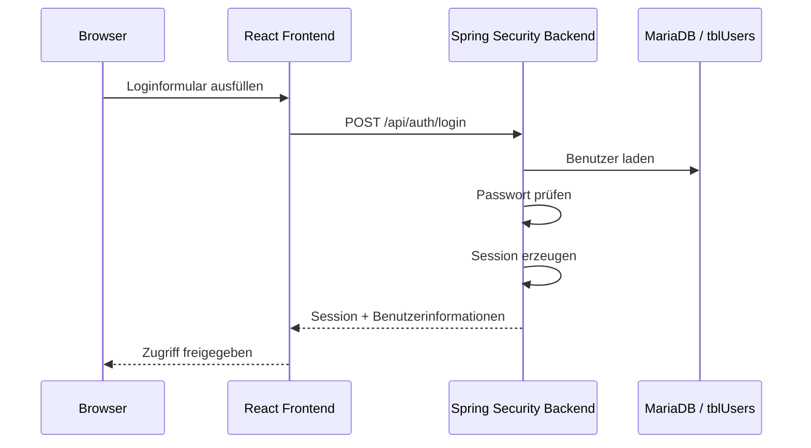
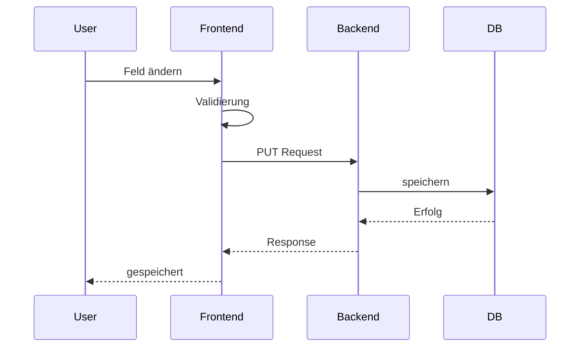
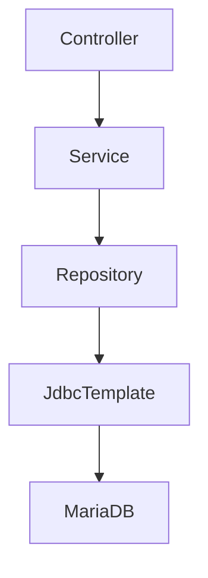

# Architekturübersicht

## Inhaltsverzeichnis

- [Architekturübersicht](#architekturübersicht)
  - [Inhaltsverzeichnis](#inhaltsverzeichnis)
  - [1. Ziel und Zweck](#1-ziel-und-zweck)
    - [1.1 Projektziel](#11-projektziel)
    - [1.2 Ausgangssituation](#12-ausgangssituation)
    - [1.3 Aktueller Betriebsstatus](#13-aktueller-betriebsstatus)
    - [1.4 Fachlicher Funktionsumfang](#14-fachlicher-funktionsumfang)
  - [2. Fachliche Systemübersicht](#2-fachliche-systemübersicht)
    - [2.1 Stammdaten](#21-stammdaten)
    - [2.2 Kontaktdaten](#22-kontaktdaten)
    - [2.3 Mitgliedschaft](#23-mitgliedschaft)
    - [2.4 Datenschutz](#24-datenschutz)
    - [2.5 Chorkleidung](#25-chorkleidung)
    - [2.6 Benutzerverwaltung](#26-benutzerverwaltung)
    - [2.7 Rollenmodell](#27-rollenmodell)
  - [3. Technische Gesamtarchitektur](#3-technische-gesamtarchitektur)
    - [3.1 High-Level Architektur](#31-high-level-architektur)
    - [3.2 Architekturprinzipien](#32-architekturprinzipien)
    - [3.3 Betriebsunterstützende Komponenten](#33-betriebsunterstützende-komponenten)
  - [4. Komponentenübersicht](#4-komponentenübersicht)
    - [4.1 Frontend](#41-frontend)
    - [4.2 Backend](#42-backend)
    - [4.3 Datenbank](#43-datenbank)
    - [4.4 Infrastruktur](#44-infrastruktur)
  - [5. Container- und Infrastrukturarchitektur](#5-container--und-infrastrukturarchitektur)
    - [5.1 EMC-Anwendungscontainer](#51-emc-anwendungscontainer)
    - [5.2 Datenhaltungscontainer](#52-datenhaltungscontainer)
    - [5.3 Betriebs- und Administrationscontainer](#53-betriebs--und-administrationscontainer)
    - [5.4 Exponierte Ports](#54-exponierte-ports)
  - [6. Docker-Netzwerkarchitektur](#6-docker-netzwerkarchitektur)
    - [6.1 EMC Hauptnetzwerk](#61-emc-hauptnetzwerk)
    - [6.2 Mitglieder des EMC Netzwerks](#62-mitglieder-des-emc-netzwerks)
    - [6.3 Kommunikationsbeziehungen](#63-kommunikationsbeziehungen)
      - [DEV](#dev)
      - [PROD](#prod)
    - [Monitoring](#monitoring)
    - [6.4 Weitere Docker-Netzwerke](#64-weitere-docker-netzwerke)
      - [mariadb\_default](#mariadb_default)
      - [uptime-kuma\_default](#uptime-kuma_default)
  - [7. Frontend-Backend-Kommunikation](#7-frontend-backend-kommunikation)
    - [DEV](#dev-1)
    - [PROD](#prod-1)
  - [8. Authentifizierungs- und Sicherheitsarchitektur](#8-authentifizierungs--und-sicherheitsarchitektur)
    - [8.1 Grundprinzip](#81-grundprinzip)
    - [8.2 Authentifizierungsendpunkte](#82-authentifizierungsendpunkte)
    - [8.3 Session-Verhalten](#83-session-verhalten)
    - [8.4 Rollenmodell](#84-rollenmodell)
    - [8.5 Backend-Autorisierung](#85-backend-autorisierung)
    - [8.6 Frontend-Autorisierung](#86-frontend-autorisierung)
    - [8.7 Passwortsicherheit](#87-passwortsicherheit)
    - [8.8 CSRF](#88-csrf)
    - [8.9 Login-Sicherheit](#89-login-sicherheit)
  - [9. API-Architektur](#9-api-architektur)
    - [9.1 Auth API](#91-auth-api)
    - [9.2 Mitglieder API](#92-mitglieder-api)
    - [9.3 Lookup API](#93-lookup-api)
    - [9.4 Admin API](#94-admin-api)
  - [10. Frontend-Architektur](#10-frontend-architektur)
    - [10.1 Technische Bausteine](#101-technische-bausteine)
    - [10.2 Verantwortlichkeiten](#102-verantwortlichkeiten)
    - [10.3 Auto-Save](#103-auto-save)
  - [11. Backend-Architektur](#11-backend-architektur)
    - [11.1 Schichtenmodell](#111-schichtenmodell)
    - [11.2 Verantwortlichkeiten](#112-verantwortlichkeiten)
    - [11.3 Transaktionen](#113-transaktionen)
    - [11.4 Fehlerbehandlung](#114-fehlerbehandlung)
    - [11.5 Request-ID Logging](#115-request-id-logging)
  - [12. Datenbankarchitektur](#12-datenbankarchitektur)
    - [12.1 Umgebungen](#121-umgebungen)
    - [12.2 Fachtabellen](#122-fachtabellen)
    - [12.3 Lookup Tabellen](#123-lookup-tabellen)
    - [12.4 Benutzerverwaltung](#124-benutzerverwaltung)
  - [13. Monitoring](#13-monitoring)
    - [13.1 Überwachte Komponenten](#131-überwachte-komponenten)
    - [13.2 Backend Monitoring](#132-backend-monitoring)
    - [13.3 Benachrichtigung](#133-benachrichtigung)
  - [14. Testing](#14-testing)
    - [Frontend](#frontend)
    - [Backend](#backend)
  - [15. Architekturentscheidungen](#15-architekturentscheidungen)
    - [15.1 Spring Boot statt Node.js](#151-spring-boot-statt-nodejs)
    - [15.2 Session statt JWT](#152-session-statt-jwt)
    - [15.3 JdbcTemplate statt JPA](#153-jdbctemplate-statt-jpa)
    - [15.4 nginx Reverse Proxy](#154-nginx-reverse-proxy)
    - [15.5 Docker auf NAS](#155-docker-auf-nas)
    - [15.6 MariaDB Port 3306 bewusst offen](#156-mariadb-port-3306-bewusst-offen)
  - [16. Geplante Architektur-Erweiterungen](#16-geplante-architektur-erweiterungen)

---

## 1. Ziel und Zweck

### 1.1 Projektziel

Die EMC Mitgliederverwaltung ist eine moderne webbasierte Anwendung zur Verwaltung der Mitgliederdaten des EMC.

Ziel des Projekts ist die schrittweise Ablösung der bisherigen Microsoft-Access-basierten operativen Mitgliederpflege durch eine wartbare, sichere und rollenbasierte Web-Anwendung.

Die Anwendung stellt eine browserbasierte Arbeitsoberfläche für die Mitgliederverwaltung bereit und bildet zentrale Vereinsprozesse in einer modernen Client-Server-Architektur ab.

---

### 1.2 Ausgangssituation

Historisch erfolgt die Mitgliederverwaltung über eine Microsoft Access Anwendung.

Bisherige Nutzung:

- operative Datenpflege in Microsoft Access
- Berichte und Auswertungen in Access
- direkter Datenbankzugriff über ODBC

Einschränkungen der bisherigen Lösung:

- eingeschränkte Mehrbenutzerfähigkeit
- komplexe Bereitstellung für externe Nutzer
- Abhängigkeit von VPN und lokaler Client-Konfiguration
- eingeschränkte Wartbarkeit
- enge Kopplung zwischen Benutzeroberfläche und Datenhaltung

Die neue Web-Anwendung ersetzt schrittweise die operative Pflege.

Die bestehende Access-Lösung bleibt zunächst für bestimmte Berichts- und Auswertungsfunktionen weiterhin im Einsatz.

> [!NOTE]
> Die vollständige Ablösung der Access-Anwendung ist perspektivisch vorgesehen, jedoch nicht Bestandteil des aktuellen Projektumfangs.

---

### 1.3 Aktueller Betriebsstatus

Die Anwendung befindet sich aktuell in einem produktivnahen Pilotbetrieb.

Aktueller Status:

- DEV Umgebung vollständig vorhanden
- PROD Umgebung technisch bereitgestellt
- produktive Nutzung aktuell durch Einzelanwender
- operative Nutzung bereits teilweise über die Web-Anwendung
- Microsoft Access weiterhin ergänzend im Einsatz

Die Lösung ist damit noch kein vollständig ausgerollter Mehrbenutzer-Produktivbetrieb.

---

### 1.4 Fachlicher Funktionsumfang

Aktuell umgesetzt:

- Mitgliederliste
- Suche
- Filterung
- Detailansicht
- Stammdatenpflege
- Kontaktdatenpflege
- Mitgliedschaftspflege
- Datenschutz (MVP-artig)
- Chorkleidung
- Benutzerverwaltung
- Rollen- und Rechteverwaltung

Geplante Erweiterungen:

- Ehrungen
- Funktionen
- Verteiler
- vollständige Access-Ablösung

---

## 2. Fachliche Systemübersicht

Die Anwendung bildet die fachliche Mitgliederverwaltung des EMC ab.

Zentrales fachliches Objekt ist das **Mitglied**.

---

### 2.1 Stammdaten

Beinhaltet allgemeine Personendaten:

- Anrede
- akademischer Titel
- Vorname
- Nachname
- Geburtsdatum
- Straße / Hausnummer
- Postleitzahl
- Ort

---

### 2.2 Kontaktdaten

Beinhaltet Kommunikationsdaten:

- Telefon privat
- Telefon geschäftlich
- Mobiltelefon
- E-Mail
- Adresszusatz
- Briefanrede

---

### 2.3 Mitgliedschaft

Beinhaltet vereinsbezogene Zuordnungen:

- Eintritt
- Austritt
- Mitgliederstatus
- Stimme
- Kammerchor-Zugehörigkeit

---

### 2.4 Datenschutz

Der Bereich Datenschutz bildet MVP-artig datenschutzbezogene Angaben zum Mitglied ab.

Dazu gehören strukturierte Informationen, die innerhalb der Mitgliederverwaltung für datenschutzbezogene Kennzeichnungen oder Einwilligungen relevant sind.

> [!NOTE]
> Dieser Bereich ersetzt kein vollständiges Datenschutz- oder DSGVO-Managementsystem.

---

### 2.5 Chorkleidung

Der Bereich Chorkleidung dient der Verwaltung chorspezifischer Kleidungsinformationen.

---

### 2.6 Benutzerverwaltung

Administratoren können Benutzerkonten innerhalb der Anwendung verwalten.

Funktionen:

- Benutzer anlegen
- Rollen ändern
- Benutzer aktiv/inaktiv setzen
- Passwort setzen
- letzte Anmeldung einsehen

---

### 2.7 Rollenmodell

Das System verwendet ein rollenbasiertes Berechtigungsmodell.

Verfügbare Rollen:

- `ADMIN`
- `EDITOR`
- `VIEWER`

Rechte werden sowohl im Backend als auch im Frontend durchgesetzt.

---

## 3. Technische Gesamtarchitektur

Die Anwendung folgt einer klassischen mehrschichtigen Web-Anwendungsarchitektur.

### 3.1 High-Level Architektur



---

### 3.2 Architekturprinzipien

Die Architektur basiert auf folgenden Grundprinzipien:

- browserbasierter Zugriff
- kein direkter Datenbankzugriff aus dem Frontend
- REST-basierte Kommunikation
- serverseitige Authentifizierung
- rollenbasierte Autorisierung
- containerisierter Betrieb via Docker
- gemeinsame Infrastruktur auf NAS

---

### 3.3 Betriebsunterstützende Komponenten

Zusätzlich:

- Uptime Kuma
- phpMyAdmin
- Portainer
- Backup-Service
- Telegram Benachrichtigungen

---

## 4. Komponentenübersicht

### 4.1 Frontend

**Technologie**

- React 19
- Vite
- React Router
- React Query
- React Hook Form
- Vitest

**Verantwortlichkeiten**

- Benutzeroberfläche
- Navigation / Routing
- Formularlogik
- clientseitige Validierung
- Auto-Save
- rollenabhängige UI-Steuerung

---

### 4.2 Backend

**Technologie**

- Java 21
- Spring Boot 3
- Spring Security
- JdbcTemplate
- Maven

**Verantwortlichkeiten**

- REST API
- Geschäftslogik
- serverseitige Validierung
- Authentifizierung
- Autorisierung
- Datenbankzugriff
- Fehlerbehandlung

---

### 4.3 Datenbank

**Technologie**

- MariaDB

DEV und PROD nutzen getrennte Datenbanken innerhalb derselben MariaDB-Instanz:

- `emc_mitglieder`
- `emc_mitglieder_dev`

---

### 4.4 Infrastruktur

- UGREEN NAS
- Docker
- Uptime Kuma
- phpMyAdmin
- Portainer
- mariadb-backup

---

## 5. Container- und Infrastrukturarchitektur

### 5.1 EMC-Anwendungscontainer

| Container                    | Funktion      |
| ---------------------------- | ------------- |
| emc-mitglieder-frontend-dev  | DEV Frontend  |
| emc-mitglieder-backend-dev   | DEV Backend   |
| emc-mitglieder-frontend-prod | PROD Frontend |
| emc-mitglieder-backend-prod  | PROD Backend  |

---

### 5.2 Datenhaltungscontainer

| Container      | Funktion           |
| -------------- | ------------------ |
| mariadb        | zentrale Datenbank |
| mariadb-backup | Backup-Service     |

---

### 5.3 Betriebs- und Administrationscontainer

| Container   | Funktion                         |
| ----------- | -------------------------------- |
| phpmyadmin  | Datenbankadministration          |
| uptime-kuma | Monitoring                       |
| portainer   | Containerverwaltung / Deployment |

---

### 5.4 Exponierte Ports

| Dienst        | Port |
| ------------- | ---- |
| DEV Frontend  | 8082 |
| PROD Frontend | 9082 |
| phpMyAdmin    | 8080 |
| MariaDB       | 3306 |
| Uptime Kuma   | 3001 |
| Portainer     | 9000 |

> [!NOTE]
> Die Spring Boot Backends sind nicht direkt extern veröffentlicht.

---

## 6. Docker-Netzwerkarchitektur

### 6.1 EMC Hauptnetzwerk

Docker Hauptnetzwerk:

```text
emc_net
```

Eigenschaften:

- Typ: `bridge`
- Subnetz: `172.18.0.0/16`

---

### 6.2 Mitglieder des EMC Netzwerks

- emc-mitglieder-frontend-dev
- emc-mitglieder-backend-dev
- emc-mitglieder-frontend-prod
- emc-mitglieder-backend-prod
- mariadb
- uptime-kuma

---

### 6.3 Kommunikationsbeziehungen

#### DEV



---

#### PROD



---

### Monitoring



> [!NOTE]
> Backend-Monitoring erfolgt bewusst über HTTP 401 Unauthorized als positives Lebenszeichen.

---

### 6.4 Weitere Docker-Netzwerke

#### mariadb_default

- mariadb
- phpmyadmin
- mariadb-backup

#### uptime-kuma_default

- uptime-kuma

---

## 7. Frontend-Backend-Kommunikation

Die Frontends kommunizieren über nginx als Reverse Proxy.

### DEV



---

### PROD



Technische Umsetzung:

- React SPA über nginx
- API Routing über `/api/`
- Weiterleitung via `proxy_pass`

Vorteile:

- keine direkte Backend-Exponierung
- saubere DEV/PROD Trennung
- gleiche Origin
- React Router SPA Support

---

## 8. Authentifizierungs- und Sicherheitsarchitektur

Die Anwendung verwendet eine sessionbasierte Authentifizierung mit Spring Security.

### 8.1 Grundprinzip



---

### 8.2 Authentifizierungsendpunkte

| Endpunkt | Zweck |
|---|---|
| `POST /api/auth/login` | Benutzer anmelden |
| `POST /api/auth/logout` | Benutzer abmelden |
| `GET /api/auth/me` | aktuelle Session prüfen |

---

### 8.3 Session-Verhalten

Nach erfolgreichem Login erzeugt Spring Security serverseitig eine Session.

Das Frontend kann über:

```text
/api/auth/me
```

prüfen, ob eine gültige Session besteht.

Eigenschaften:

- serverseitige Sessionverwaltung
- Session Restore beim Frontend Start
- keine Tokenverwaltung im Frontend

---

### 8.4 Rollenmodell

Die Anwendung verwendet drei Rollen.

| Rolle | Rechte |
|---|---|
| `ADMIN` | vollständige Mitgliederverwaltung + Benutzerverwaltung |
| `EDITOR` | Mitglieder lesen und bearbeiten |
| `VIEWER` | Mitglieder nur lesen |

Die Rollen werden direkt in:

```text
tblUsers
```

gespeichert.

Es existiert aktuell keine separate Rollen- oder Mapping-Tabelle.

---

### 8.5 Backend-Autorisierung

Die verbindliche Autorisierung erfolgt im Backend.

| Bereich | Zugriff |
|---|---|
| `/api/auth/login` | öffentlich |
| `/api/auth/me` | angemeldete Benutzer |
| `/api/auth/logout` | angemeldete Benutzer |
| `/api/admin/**` | nur `ADMIN` |
| `GET /api/lookups/**` | `ADMIN`, `EDITOR`, `VIEWER` |
| `GET /api/members/**` | `ADMIN`, `EDITOR`, `VIEWER` |
| `POST /api/members` | `ADMIN`, `EDITOR` |
| `PUT /api/members/**` | `ADMIN`, `EDITOR` |
| `DELETE /api/members/**` | nur `ADMIN` |

---

### 8.6 Frontend-Autorisierung

Das Frontend blendet Funktionen rollenabhängig ein oder aus.

Beispiele:

- Benutzerverwaltung nur für `ADMIN`
- Bearbeitungsfunktionen nur für `ADMIN` und `EDITOR`
- reine Lesefunktion für `VIEWER`

> [!NOTE]
> Die Frontend-Autorisierung dient der Benutzerführung. Sicherheitsrelevant ist ausschließlich die Backend-Prüfung.

---

### 8.7 Passwortsicherheit

Passwörter werden nicht im Klartext gespeichert.

Das Backend verwendet:

```text
BCryptPasswordEncoder
```

---

### 8.8 CSRF

CSRF-Schutz ist aktuell deaktiviert.

Implementierung:

```java
csrf(csrf -> csrf.disable())
```

Diese Entscheidung wurde im aktuellen Pilotbetrieb bewusst pragmatisch getroffen.

> [!WARNING]
> Bei künftigem echtem Internetbetrieb (Domain / DynDNS / Reverse Proxy) sollte die CSRF-Strategie erneut bewertet werden.

---

### 8.9 Login-Sicherheit

Login-Fehlermeldungen sind bewusst neutral gehalten.

Ziel:

- keine Preisgabe sicherheitsrelevanter Details
- keine Information, ob Benutzername oder Passwort falsch war

---

## 9. API-Architektur

Das Backend stellt eine REST-API unterhalb von:

```text
/api
```

bereit.

---

### 9.1 Auth API

| Methode | Endpunkt | Zweck |
|---|---|---|
| `POST` | `/api/auth/login` | Anmeldung |
| `POST` | `/api/auth/logout` | Abmeldung |
| `GET` | `/api/auth/me` | Session prüfen |

---

### 9.2 Mitglieder API

| Methode | Endpunkt | Zweck |
|---|---|---|
| `GET` | `/api/members` | Mitgliederliste |
| `GET` | `/api/members/{mitgliedsnummer}` | Mitglied Detail |
| `POST` | `/api/members` | Mitglied anlegen |
| `PUT` | `/api/members/{mitgliedsnummer}/stammdaten` | Stammdaten ändern |
| `PUT` | `/api/members/{mitgliedsnummer}/kontakt` | Kontaktdaten ändern |
| `PUT` | `/api/members/{mitgliedsnummer}/mitgliedschaft` | Mitgliedschaft ändern |
| `GET` | `/api/members/{mitgliedsnummer}/datenschutz` | Datenschutz lesen |
| `PUT` | `/api/members/{mitgliedsnummer}/datenschutz` | Datenschutz ändern |
| `GET` | `/api/members/{mitgliedsnummer}/chorkleidung` | Chorkleidung lesen |
| `PUT` | `/api/members/{mitgliedsnummer}/chorkleidung` | Chorkleidung ändern |

---

### 9.3 Lookup API

| Methode | Endpunkt | Zweck |
|---|---|---|
| `GET` | `/api/lookups/member-status` | Mitgliederstatus |
| `GET` | `/api/lookups/voices` | Stimmen |

---

### 9.4 Admin API

| Methode | Endpunkt | Zweck |
|---|---|---|
| `GET` | `/api/admin/users` | Benutzerliste |
| `POST` | `/api/admin/users` | Benutzer anlegen |
| `PUT` | `/api/admin/users/{id}/role` | Rolle ändern |
| `PUT` | `/api/admin/users/{id}/active` | aktiv/inaktiv |
| `PUT` | `/api/admin/users/{id}/password` | Passwort setzen |

---

## 10. Frontend-Architektur

Das Frontend ist eine React Single Page Application.

### 10.1 Technische Bausteine

| Technologie | Zweck |
|---|---|
| React | UI |
| Vite | Build |
| React Router | Navigation |
| React Query | Server State |
| React Hook Form | Formulare |
| Vitest | Unit Tests |

---

### 10.2 Verantwortlichkeiten

Das Frontend übernimmt:

- Benutzeroberfläche
- Routing
- Session Restore
- Formularsteuerung
- Validierung
- Auto-Save
- Rollenabhängige UI

---

### 10.3 Auto-Save

Formularbereiche speichern Änderungen automatisch.



---

## 11. Backend-Architektur

Das Backend folgt einer klassischen Schichtenarchitektur.

### 11.1 Schichtenmodell



---

### 11.2 Verantwortlichkeiten

| Schicht | Aufgabe |
|---|---|
| Controller | REST-Endpunkte |
| Service | Geschäftslogik |
| Repository | SQL Zugriff |
| Mapper | DTO Mapping |
| DTOs | API Modelle |
| Exception Handling | zentrale Fehlerbehandlung |

---

### 11.3 Transaktionen

Mitgliedsanlage erfolgt transaktional.

Betroffene Tabellen:

- `tblMitglieder`
- `tblKontaktdaten`
- `tblMitgliedschaft`
- `tblDatenschutz`
- `tblChorkleidung`

---

### 11.4 Fehlerbehandlung

Zentrale Fehlerbehandlung über:

```text
GlobalExceptionHandler
```

Behandelt:

- Validierungsfehler
- fachliche Fehler
- Datenbankfehler
- Konflikte
- Authentifizierungsfehler
- unerwartete Serverfehler

---

### 11.5 Request-ID Logging

Das Backend nutzt:

```text
X-Request-Id
```

Ziel:

- Fehlerkorrelation
- Nachvollziehbarkeit
- Betriebsanalyse

---

## 12. Datenbankarchitektur

MariaDB bildet die zentrale Datenhaltung.

---

### 12.1 Umgebungen

| Umgebung | Datenbank |
|---|---|
| DEV | `emc_mitglieder_dev` |
| PROD | `emc_mitglieder` |

---

### 12.2 Fachtabellen

- `tblMitglieder`
- `tblKontaktdaten`
- `tblMitgliedschaft`
- `tblDatenschutz`
- `tblChorkleidung`
- `tblUsers`

---

### 12.3 Lookup Tabellen

- `tblMitgliederstatus_FT`
- `tblStimme_FT`

Perspektivisch:

- Ehrungen
- Funktionen
- Verteiler

---

### 12.4 Benutzerverwaltung

Benutzer liegen in:

```text
tblUsers
```

Relevante Informationen:

- Benutzername
- Passwort Hash
- Rolle
- aktiv/inaktiv
- letzte Anmeldung

---

## 13. Monitoring

Monitoring erfolgt über:

```text
Uptime Kuma
```

---

### 13.1 Überwachte Komponenten

- Frontend DEV
- Frontend PROD
- Backend DEV
- Backend PROD
- MariaDB
- phpMyAdmin
- Portainer
- mariadb-backup

---

### 13.2 Backend Monitoring

Backend liefert bewusst:

```text
HTTP 401 Unauthorized
```

als positives Lebenszeichen.

> [!NOTE]
> Das bedeutet nicht „Fehler“, sondern „Security aktiv“.

---

### 13.3 Benachrichtigung

Benachrichtigungen erfolgen via Telegram.

---

## 14. Testing

### Frontend

Vitest Unit Tests vorhanden.

Aktuell abgedeckt:

- validationHelpers
- dateHelpers
- stammdatenValidator
- membershipValidator
- contactValidator
- datenschutzValidator
- chorkleidungValidator

Stand:

```text
64 erfolgreiche Unit Tests
```

---

### Backend

Automatisierte Tests vorhanden.

Abgedeckte Bereiche:

- Auth
- Admin User
- Member Controller
- Member Service
- Mapper
- Security
- Context

Stand:

```text
35 erfolgreiche Tests
```

---

## 15. Architekturentscheidungen

### 15.1 Spring Boot statt Node.js

Frühe Konzepte sahen Node.js vor.

Final entschieden:

```text
Spring Boot 3
```

Gründe:

- Spring Security
- robuste Architektur
- Validierung
- Testbarkeit

---

### 15.2 Session statt JWT

Gründe:

- einfachere Integration
- keine Tokenverwaltung
- Session Restore
- klassische Web-Anwendung

---

### 15.3 JdbcTemplate statt JPA

Gründe:

- volle SQL Kontrolle
- bestehende DB passt gut
- weniger ORM Komplexität

---

### 15.4 nginx Reverse Proxy

Gründe:

- Backend nicht direkt exponieren
- gleiche Origin
- saubere DEV/PROD Trennung
- SPA Support

---

### 15.5 Docker auf NAS

Gründe:

- reproduzierbar
- modular
- gut administrierbar
- Monitoring integrierbar

---

### 15.6 MariaDB Port 3306 bewusst offen

Grund:

- Access / ODBC Altwelt

> [!WARNING]
> Nicht ins öffentliche Internet exponieren.

---

## 16. Geplante Architektur-Erweiterungen

Perspektivisch:

- Domain / DynDNS Zugriff
- Reverse Proxy / TLS
- Security Härtung
- Ehrungen
- Funktionen
- Verteiler
- vollständige Access Ablösung
- mehr Integrationstests
- erweitertes Backup / Restore